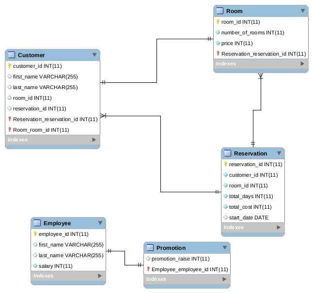

## MYSQL Database Project for Hotel Reservation System

### Description: 
Hotel Reservation System is a system which allows any “Customer” to reserve a “Room” in a hotel and decide how many days he wants to reserve the room then a reservation is generated containing the room id, customer id, length of the reservation, total price the customer should pay.

Each room has a certain price if anyone wants to reserve it and also contains an attribute which refers to the number of rooms in this room.

### Code:
every group of quries is collected in a file
But also there is <a href="https://github.com/Oaik/Hotel-Reservation-database/blob/master/all.sql">"all.sql"</a> which file contains all quries in sequence 

### Entity Relationship Diagram
demo:

